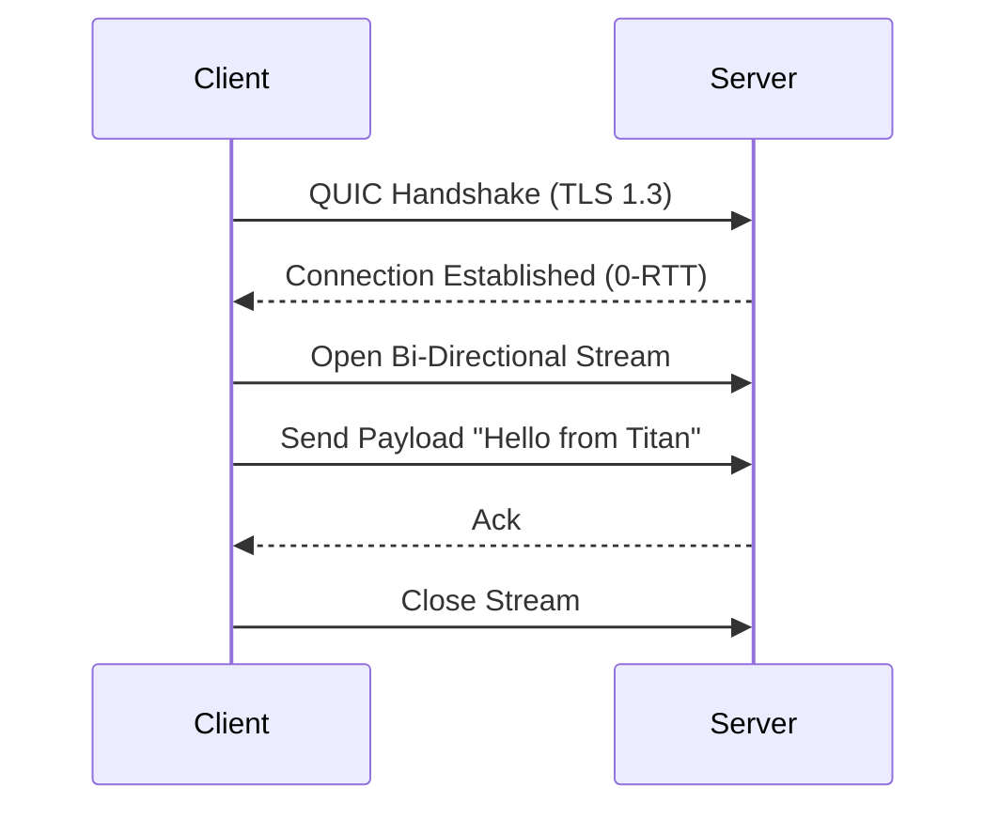

<div align="center">

```
  ██╗██████╗ ██╗███████╗
  ██║██╔══██╗██║██╔════╝
  ██║██████╔╝██║███████╗
  ██║██╔══██╗██║╚════██║
  ██║██║  ██║██║███████║
  ╚═╝╚═╝  ╚═╝╚═╝╚══════╝
```

### 🛡️ System 14/300 — High-Performance QUIC Tunnel

[](https://www.rust-lang.org/)
[](https://quicwg.org/)
[](LICENSE)

**A secure, low-latency tunneling system built on top of Quinn (QUIC implementation).**

</div>

---

## 📖 What is IRIS?

IRIS is a Layer 2 tunneling simulation using **QUIC (Quick UDP Internet Connections)**.
It demonstrates:

- 🚀 **Zero-RTT** connection establishment.
- 🔒 **TLS 1.3** integration with self-signed certificates.
- 📡 **Multiplexed Streams** over a single UDP connection.

## 🚀 Getting Started

### Prerequisites

- **Rust**: `v1.75` or later.
- **Cargo**: Included with Rust.

### Installation

```bash
git clone https://github.com/DaviBonetto/IRIS-L2-QUIC-Tunnel.git
cd IRIS-L2-QUIC-Tunnel
```

### Running the Simulation

We have included a verified simulation script to test the tunnel:

**PowerShell (Windows)**
```powershell
./simulate_v2.ps1
```

**Bash (Linux/macOS)**
```bash
# You may need to grant execution permissions
chmod +x simulate_tunnel.sh
./simulate_tunnel.sh
```

## 🏗️ Architecture



## 📄 License

Distributed under the MIT License. See `LICENSE` for more information.
